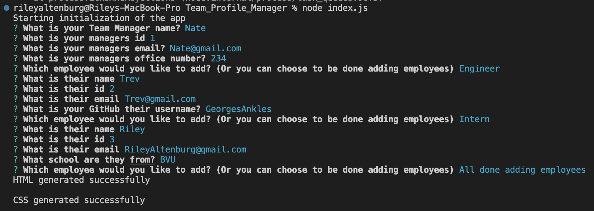
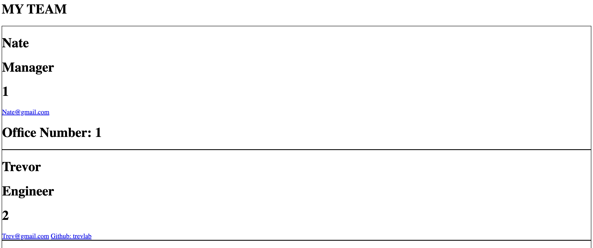

# Team_Profile_Manager

### Author

Riley Altenburg

If you'd like to contact me, please email RileyAltenburg@gmail.com

### GitHub Information

Find my Repository information here at: https://github.com/RileyAlt/Team_Profile_Manager

### Description

My Motivation for the project was to understand Node items further and introducing creating an HTML web page from your terminal
The project was built to create a responsive webpage that can create a team regardless of the size and display different data for each section
This solved how to generate a HTML wbepage from yuor command terminal
What I learn from the project was how to use Node properties to create an HTML webpage, also starting to loop over functions so i can reapeat any action i want over and over again.

### Installation

You must Run NPM Install or (NPM I) before starting your testing, to start the testing you must run the command "node index.js" (Alldependant on where you are to run the specific file.)

### Usage

The program runs as follows:

### Licensing

MIT

### Contributors

None

### Testing
